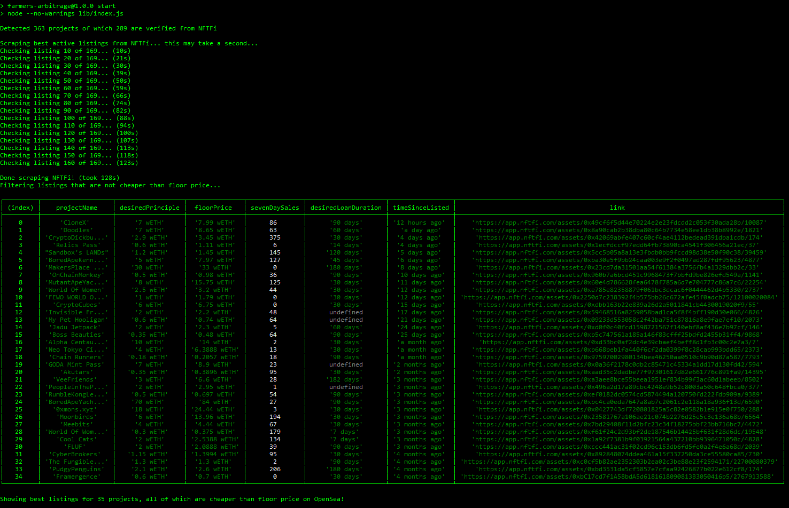

# NFTFi x OpenSea Arbitrage Scouter

### Find listed NFTFi assets that are cheaper than the current floor price on exchanges.

<br />

### This project uses experimental features from **Node v18** please update if you have issues running it.

<br />

## How to use:
1. ) download git project to a new folder `git clone https://github.com/creativebuilds/farmers-arbitrage`
2. ) install node_modules `npm install`
3. ) run `npm start`
4. ) Enjoy arbitrage!

**TIP**: Zoom out your terminal in order to see the full table output

### Example Output


## Module Usage:
An alternative usecase for this package is to run it as a module.

Simply import the functions you need from `lib/utils`

```js
import {NFTFiTotalListings, NFTFiListingsForProject} from 'farmers-arbitrage/lib/utils';

const listings = await NFTFiTotalListings();
const first_twenty_listings = await NFTFiListingsForProject(listings[0]._id, 0);

console.log(first_twenty_listings);
 ```
 
<br />

( OPTIONAL ) to build from source run `npm run build`  
NOTE: you'll receive some errors as the tests folder is not located in `/src` these are nominal


( OPTIONAL ) to test run `npm run test`
